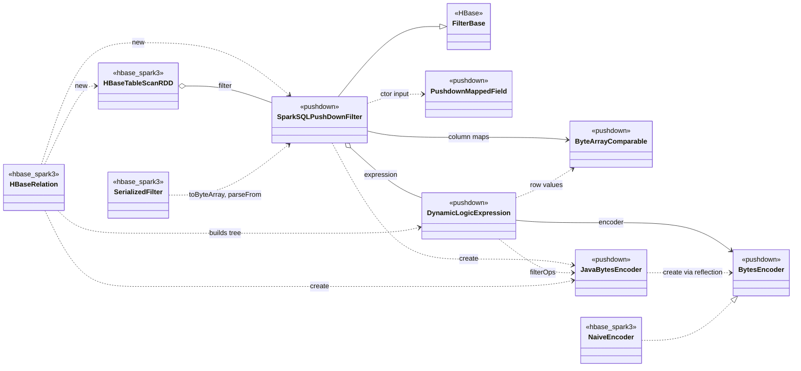

```mermaid
classDiagram
  direction LR

  class FilterBase
  <<HBase>> FilterBase

  class SparkSQLPushDownFilter
  <<pushdown>> SparkSQLPushDownFilter
  class PushdownMappedField
  <<pushdown>> PushdownMappedField
  class ByteArrayComparable
  <<pushdown>> ByteArrayComparable
  class DynamicLogicExpression
  <<pushdown>> DynamicLogicExpression
  class BytesEncoder
  <<pushdown>> BytesEncoder
  class JavaBytesEncoder
  <<pushdown>> JavaBytesEncoder

  class HBaseRelation
  <<hbase_spark3>> HBaseRelation
  class HBaseTableScanRDD
  <<hbase_spark3>> HBaseTableScanRDD
  class SerializedFilter
  <<hbase_spark3>> SerializedFilter
  class NaiveEncoder
  <<hbase_spark3>> NaiveEncoder

  SparkSQLPushDownFilter --|> FilterBase
  SparkSQLPushDownFilter o-- DynamicLogicExpression : expression
  SparkSQLPushDownFilter --> ByteArrayComparable : column maps
  SparkSQLPushDownFilter ..> PushdownMappedField : ctor input
  SparkSQLPushDownFilter ..> JavaBytesEncoder : create
  DynamicLogicExpression --> BytesEncoder : encoder
  DynamicLogicExpression ..> ByteArrayComparable : row values
  DynamicLogicExpression ..> JavaBytesEncoder : filterOps
  JavaBytesEncoder ..> BytesEncoder : create via reflection

  NaiveEncoder ..|> BytesEncoder
  HBaseRelation ..> JavaBytesEncoder : create
  HBaseRelation ..> DynamicLogicExpression : builds tree
  HBaseRelation ..> SparkSQLPushDownFilter : new
  HBaseRelation ..> HBaseTableScanRDD : new
  HBaseTableScanRDD o-- SparkSQLPushDownFilter : filter
  SerializedFilter ..> SparkSQLPushDownFilter : toByteArray, parseFrom
```