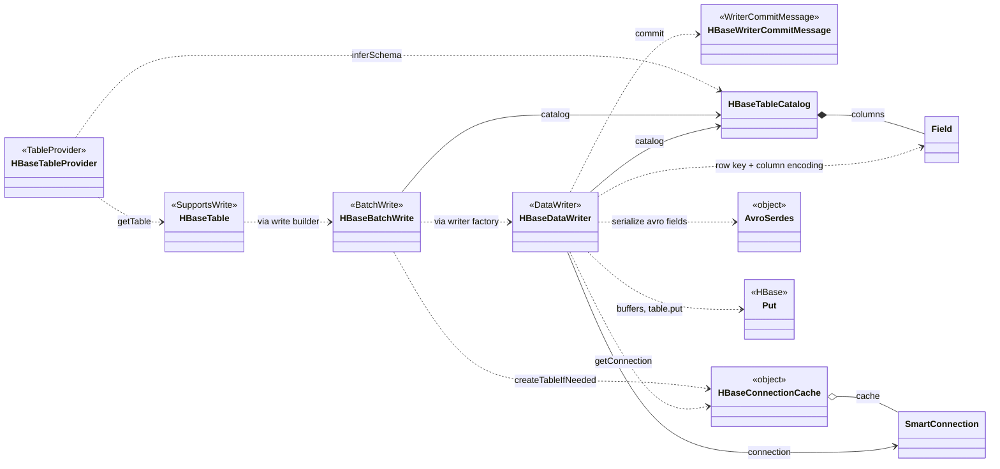

```mermaid
classDiagram
  direction LR

  class HBaseTableProvider
  <<TableProvider>> HBaseTableProvider
  class HBaseTable
  <<SupportsWrite>> HBaseTable
  class HBaseBatchWrite
  <<BatchWrite>> HBaseBatchWrite
  class HBaseDataWriter
  <<DataWriter>> HBaseDataWriter
  class HBaseWriterCommitMessage
  <<WriterCommitMessage>> HBaseWriterCommitMessage

  class HBaseTableCatalog
  class Field
  class HBaseConnectionCache
  <<object>> HBaseConnectionCache
  class SmartConnection
  class AvroSerdes
  <<object>> AvroSerdes
  class Put
  <<HBase>> Put

  HBaseTableProvider ..> HBaseTable : getTable
  HBaseTableProvider ..> HBaseTableCatalog : inferSchema
  HBaseTable ..> HBaseBatchWrite : via write builder
  HBaseBatchWrite --> HBaseTableCatalog : catalog
  HBaseBatchWrite ..> HBaseConnectionCache : createTableIfNeeded
  HBaseBatchWrite ..> HBaseDataWriter : via writer factory

  HBaseTableCatalog *-- Field : columns
  HBaseDataWriter --> HBaseTableCatalog : catalog
  HBaseDataWriter ..> Field : row key + column encoding
  HBaseDataWriter ..> HBaseConnectionCache : getConnection
  HBaseConnectionCache o-- SmartConnection : cache
  HBaseDataWriter --> SmartConnection : connection
  HBaseDataWriter ..> AvroSerdes : serialize avro fields
  HBaseDataWriter ..> Put : buffers, table.put
  HBaseDataWriter ..> HBaseWriterCommitMessage : commit
```