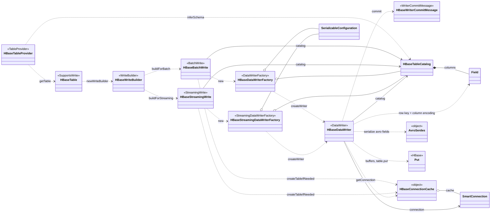

```mermaid
classDiagram
direction LR

class HBaseTableProvider
<<TableProvider>> HBaseTableProvider
class HBaseTable
<<SupportsWrite>> HBaseTable
class HBaseWriteBuilder
<<WriteBuilder>> HBaseWriteBuilder
class HBaseBatchWrite
<<BatchWrite>> HBaseBatchWrite
class HBaseStreamingWrite
<<StreamingWrite>> HBaseStreamingWrite
class HBaseDataWriterFactory
<<DataWriterFactory>> HBaseDataWriterFactory
class HBaseStreamingDataWriterFactory
<<StreamingDataWriterFactory>> HBaseStreamingDataWriterFactory
class HBaseDataWriter
<<DataWriter>> HBaseDataWriter
class HBaseWriterCommitMessage
<<WriterCommitMessage>> HBaseWriterCommitMessage

class HBaseTableCatalog
class Field
class SerializableConfiguration
class HBaseConnectionCache
<<object>> HBaseConnectionCache
class SmartConnection
class AvroSerdes
<<object>> AvroSerdes
class Put
<<HBase>> Put

HBaseTableProvider ..> HBaseTable : getTable
HBaseTableProvider ..> HBaseTableCatalog : inferSchema
HBaseTable ..> HBaseWriteBuilder : newWriteBuilder
HBaseWriteBuilder ..> HBaseBatchWrite : buildForBatch
HBaseWriteBuilder ..> HBaseStreamingWrite : buildForStreaming

HBaseBatchWrite --> HBaseTableCatalog : catalog
HBaseStreamingWrite --> HBaseTableCatalog : catalog
HBaseBatchWrite ..> HBaseConnectionCache : createTableIfNeeded
HBaseStreamingWrite ..> HBaseConnectionCache : createTableIfNeeded
HBaseBatchWrite ..> HBaseDataWriterFactory : new
HBaseStreamingWrite ..> HBaseStreamingDataWriterFactory : new

HBaseDataWriterFactory o-- HBaseTableCatalog
HBaseDataWriterFactory o-- SerializableConfiguration
HBaseStreamingDataWriterFactory o-- HBaseTableCatalog
HBaseStreamingDataWriterFactory o-- SerializableConfiguration
HBaseDataWriterFactory ..> HBaseDataWriter : createWriter
HBaseStreamingDataWriterFactory ..> HBaseDataWriter : createWriter

HBaseTableCatalog *-- Field : columns
HBaseDataWriter --> HBaseTableCatalog : catalog
HBaseDataWriter ..> Field : row key + column encoding
HBaseDataWriter ..> HBaseConnectionCache : getConnection
HBaseConnectionCache o-- SmartConnection : cache
HBaseDataWriter --> SmartConnection : connection
HBaseDataWriter ..> AvroSerdes : serialize avro fields
HBaseDataWriter ..> Put : buffers, table.put
HBaseDataWriter ..> HBaseWriterCommitMessage : commit
```