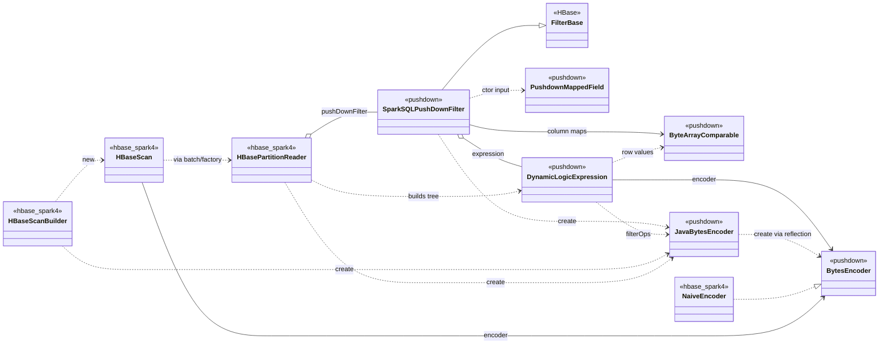

```mermaid
classDiagram
  direction LR

  class FilterBase
  <<HBase>> FilterBase

  class SparkSQLPushDownFilter
  <<pushdown>> SparkSQLPushDownFilter
  class PushdownMappedField
  <<pushdown>> PushdownMappedField
  class ByteArrayComparable
  <<pushdown>> ByteArrayComparable
  class DynamicLogicExpression
  <<pushdown>> DynamicLogicExpression
  class BytesEncoder
  <<pushdown>> BytesEncoder
  class JavaBytesEncoder
  <<pushdown>> JavaBytesEncoder

  class HBaseScanBuilder
  <<hbase_spark4>> HBaseScanBuilder
  class HBaseScan
  <<hbase_spark4>> HBaseScan
  class HBasePartitionReader
  <<hbase_spark4>> HBasePartitionReader
  class NaiveEncoder
  <<hbase_spark4>> NaiveEncoder

  SparkSQLPushDownFilter --|> FilterBase
  SparkSQLPushDownFilter o-- DynamicLogicExpression : expression
  SparkSQLPushDownFilter --> ByteArrayComparable : column maps
  SparkSQLPushDownFilter ..> PushdownMappedField : ctor input
  SparkSQLPushDownFilter ..> JavaBytesEncoder : create
  DynamicLogicExpression --> BytesEncoder : encoder
  DynamicLogicExpression ..> ByteArrayComparable : row values
  DynamicLogicExpression ..> JavaBytesEncoder : filterOps
  JavaBytesEncoder ..> BytesEncoder : create via reflection

  NaiveEncoder ..|> BytesEncoder
  HBaseScanBuilder ..> JavaBytesEncoder : create
  HBaseScanBuilder ..> HBaseScan : new
  HBaseScan --> BytesEncoder : encoder
  HBaseScan ..> HBasePartitionReader : via batch/factory
  HBasePartitionReader ..> JavaBytesEncoder : create
  HBasePartitionReader ..> DynamicLogicExpression : builds tree
  HBasePartitionReader o-- SparkSQLPushDownFilter : pushDownFilter
```