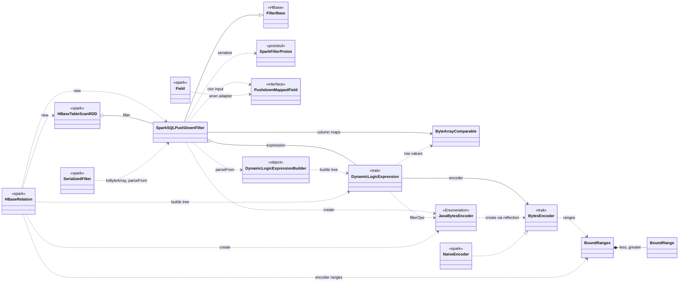

```mermaid
classDiagram
  direction LR

  class FilterBase
  <<HBase>> FilterBase
  class SparkFilterProtos
  <<protobuf>> SparkFilterProtos

  class SparkSQLPushDownFilter
  class PushdownMappedField
  <<interface>> PushdownMappedField
  class ByteArrayComparable
  class DynamicLogicExpression
  <<trait>> DynamicLogicExpression
  class DynamicLogicExpressionBuilder
  <<object>> DynamicLogicExpressionBuilder
  class BytesEncoder
  <<trait>> BytesEncoder
  class JavaBytesEncoder
  <<Enumeration>> JavaBytesEncoder
  class BoundRanges
  class BoundRange

  class HBaseRelation
  <<spark>> HBaseRelation
  class HBaseTableScanRDD
  <<spark>> HBaseTableScanRDD
  class SerializedFilter
  <<spark>> SerializedFilter
  class NaiveEncoder
  <<spark>> NaiveEncoder
  class Field
  <<spark>> Field

  SparkSQLPushDownFilter --|> FilterBase
  SparkSQLPushDownFilter o-- DynamicLogicExpression : expression
  SparkSQLPushDownFilter --> ByteArrayComparable : column maps
  SparkSQLPushDownFilter ..> PushdownMappedField : ctor input
  SparkSQLPushDownFilter ..> DynamicLogicExpressionBuilder : parseFrom
  SparkSQLPushDownFilter ..> JavaBytesEncoder : create
  SparkSQLPushDownFilter ..> SparkFilterProtos : serialize
  DynamicLogicExpression --> BytesEncoder : encoder
  DynamicLogicExpression ..> ByteArrayComparable : row values
  DynamicLogicExpression ..> JavaBytesEncoder : filterOps
  DynamicLogicExpressionBuilder ..> DynamicLogicExpression : builds tree
  BytesEncoder ..> BoundRanges : ranges
  BoundRanges *-- BoundRange : less, greater
  JavaBytesEncoder ..> BytesEncoder : create via reflection

  NaiveEncoder ..|> BytesEncoder
  HBaseRelation ..> JavaBytesEncoder : create
  HBaseRelation ..> DynamicLogicExpression : builds tree
  HBaseRelation ..> BoundRanges : encoder ranges
  HBaseRelation ..> SparkSQLPushDownFilter : new
  HBaseRelation ..> HBaseTableScanRDD : new
  Field ..> PushdownMappedField : anon adapter
  HBaseTableScanRDD o-- SparkSQLPushDownFilter : filter
  SerializedFilter ..> SparkSQLPushDownFilter : toByteArray, parseFrom
```