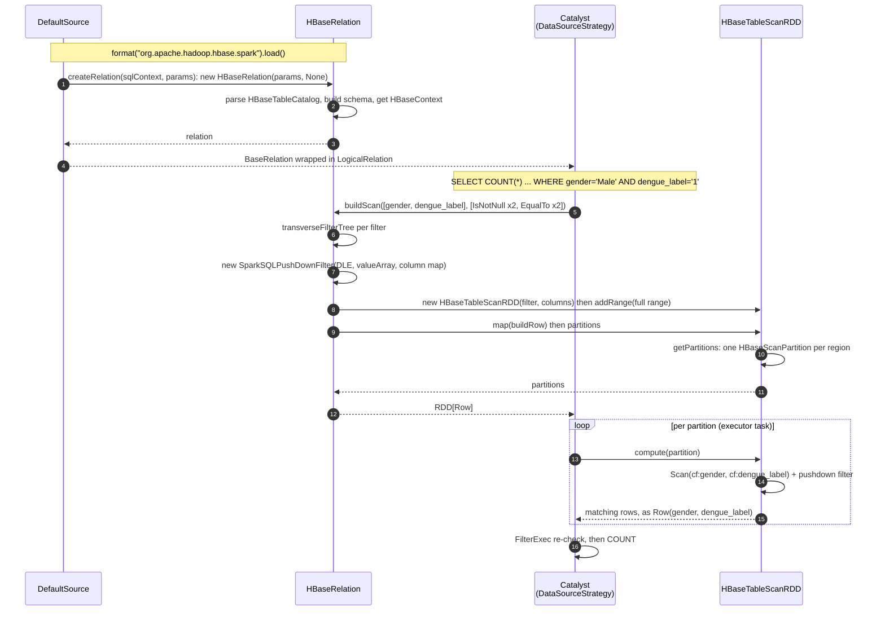

```mermaid
sequenceDiagram
    autonumber
    participant DS as DefaultSource
    participant HR as HBaseRelation
    participant CAT as Catalyst<br/>(DataSourceStrategy)
    participant RDD as HBaseTableScanRDD

    Note over DS,HR: format("org.apache.hadoop.hbase.spark").load()
    DS->>HR: createRelation(sqlContext, params): new HBaseRelation(params, None)
    HR->>HR: parse HBaseTableCatalog, build schema, get HBaseContext
    HR-->>DS: relation
    DS-->>CAT: BaseRelation wrapped in LogicalRelation

    Note over CAT: SELECT COUNT(*) ... WHERE gender='Male' AND dengue_label='1'
    CAT->>HR: buildScan([gender, dengue_label], [IsNotNull x2, EqualTo x2])
    HR->>HR: transverseFilterTree per filter
    HR->>HR: new SparkSQLPushDownFilter(DLE, valueArray, column map)
    HR->>RDD: new HBaseTableScanRDD(filter, columns) then addRange(full range)
    HR->>RDD: map(buildRow) then partitions
    RDD->>RDD: getPartitions: one HBaseScanPartition per region
    RDD-->>HR: partitions
    HR-->>CAT: RDD[Row]

    loop per partition (executor task)
        CAT->>RDD: compute(partition)
        RDD->>RDD: Scan(cf:gender, cf:dengue_label) + pushdown filter
        RDD-->>CAT: matching rows, as Row(gender, dengue_label)
    end
    CAT->>CAT: FilterExec re-check, then COUNT
```