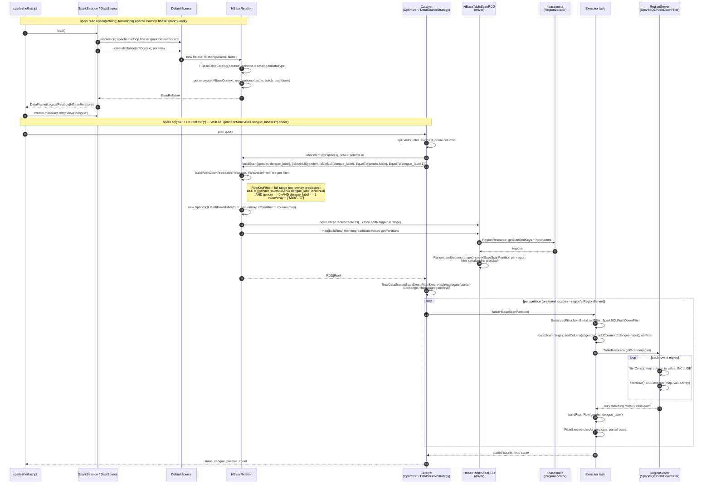

```mermaid
sequenceDiagram
    autonumber
    participant U as spark-shell script
    participant SS as SparkSession / DataSource
    participant DS as DefaultSource
    participant HR as HBaseRelation
    participant CAT as Catalyst<br/>(Optimizer / DataSourceStrategy)
    participant RDD as HBaseTableScanRDD<br/>(driver)
    participant META as hbase:meta<br/>(RegionLocator)
    participant EX as Executor task
    participant RS as RegionServer<br/>(SparkSQLPushDownFilter)

    Note over U,HR: spark.read.option(catalog).format("org.apache.hadoop.hbase.spark").load()
    U->>SS: load()
    SS->>DS: resolve org.apache.hadoop.hbase.spark.DefaultSource
    SS->>DS: createRelation(sqlContext, params)
    DS->>HR: new HBaseRelation(params, None)
    HR->>HR: HBaseTableCatalog(params), schema = catalog.toDataType
    HR->>HR: get or create HBaseContext, read options (cache, batch, pushdown)
    HR-->>SS: BaseRelation
    SS-->>U: DataFrame(LogicalRelation(HBaseRelation))
    U->>SS: createOrReplaceTempView("dengue")

    Note over U,CAT: spark.sql("SELECT COUNT(*) ... WHERE gender='Male' AND dengue_label='1'").show()
    U->>CAT: plan query
    CAT->>CAT: split AND, infer IsNotNull, prune columns
    CAT->>HR: unhandledFilters(filters), default returns all
    CAT->>HR: buildScan([gender, dengue_label], [IsNotNull(gender), IsNotNull(dengue_label), EqualTo(gender,Male), EqualTo(dengue_label,1)])
    HR->>HR: buildPushDownPredicatesResource, transverseFilterTree per filter
    Note right of HR: RowKeyFilter = full range (no rowkey predicates)<br/>DLE = ((gender isNotNull AND dengue_label isNotNull)<br/>AND gender == 0) AND dengue_label == 1<br/>valueArray = ["Male", "1"]
    HR->>HR: new SparkSQLPushDownFilter(DLE, valueArray, cf/qualifier to column map)
    HR->>RDD: new HBaseTableScanRDD(...) then addRange(full range)
    HR->>RDD: map(buildRow) then tmp.partitions forces getPartitions
    RDD->>META: RegionResource: getStartEndKeys + hostnames
    META-->>RDD: regions
    RDD->>RDD: Ranges.and(region, ranges): one HBaseScanPartition per region<br/>filter serialized to protobuf
    HR-->>CAT: RDD[Row]
    CAT->>CAT: RowDataSourceScanExec, FilterExec, HashAggregate(partial),<br/>Exchange, HashAggregate(final)

    loop per partition (preferred location = region's RegionServer)
        CAT->>EX: task(HBaseScanPartition)
        EX->>EX: SerializedFilter.fromSerializedFilter: SparkSQLPushDownFilter
        EX->>EX: buildScan(range): addColumn(cf:gender), addColumn(cf:dengue_label), setFilter
        EX->>RS: TableResource.getScanner(scan)
        loop each row in region
            RS->>RS: filterCell(c): map column to value, INCLUDE
            RS->>RS: filterRow(): DLE.execute(map, valueArray)
        end
        RS-->>EX: only matching rows (2 cells each)
        EX->>EX: buildRow: Row(gender, dengue_label)
        EX->>EX: FilterExec re-checks predicate, partial count
    end
    EX-->>CAT: partial counts, final count
    CAT-->>U: male_dengue_positive_count
```