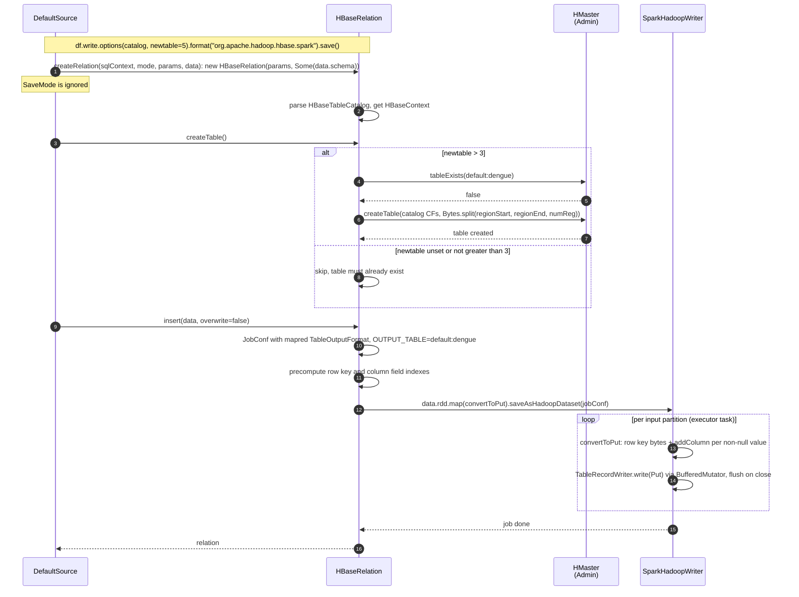

```mermaid
sequenceDiagram
    autonumber
    participant DS as DefaultSource
    participant HR as HBaseRelation
    participant HM as HMaster<br/>(Admin)
    participant SHW as SparkHadoopWriter

    Note over DS,HR: df.write.options(catalog, newtable=5).format("org.apache.hadoop.hbase.spark").save()
    DS->>HR: createRelation(sqlContext, mode, params, data): new HBaseRelation(params, Some(data.schema))
    Note over DS: SaveMode is ignored
    HR->>HR: parse HBaseTableCatalog, get HBaseContext

    DS->>HR: createTable()
    alt newtable > 3
        HR->>HM: tableExists(default:dengue)
        HM-->>HR: false
        HR->>HM: createTable(catalog CFs, Bytes.split(regionStart, regionEnd, numReg))
        HM-->>HR: table created
    else newtable unset or not greater than 3
        HR->>HR: skip, table must already exist
    end

    DS->>HR: insert(data, overwrite=false)
    HR->>HR: JobConf with mapred TableOutputFormat, OUTPUT_TABLE=default:dengue
    HR->>HR: precompute row key and column field indexes
    HR->>SHW: data.rdd.map(convertToPut).saveAsHadoopDataset(jobConf)

    loop per input partition (executor task)
        SHW->>SHW: convertToPut: row key bytes + addColumn per non-null value
        SHW->>SHW: TableRecordWriter.write(Put) via BufferedMutator, flush on close
    end
    SHW-->>HR: job done
    HR-->>DS: relation
```