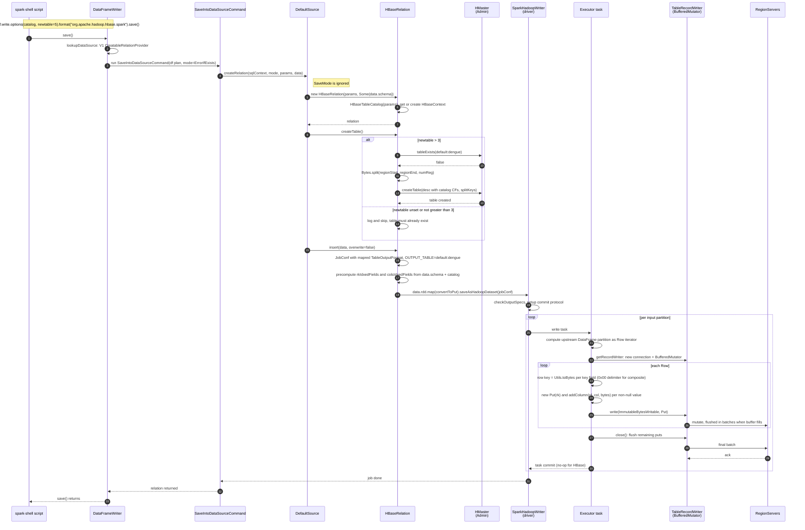

```mermaid
sequenceDiagram
    autonumber
    participant U as spark-shell script
    participant DFW as DataFrameWriter
    participant CMD as SaveIntoDataSourceCommand
    participant DS as DefaultSource
    participant HR as HBaseRelation
    participant HM as HMaster<br/>(Admin)
    participant SHW as SparkHadoopWriter<br/>(driver)
    participant EX as Executor task
    participant TRW as TableRecordWriter<br/>(BufferedMutator)
    participant RS as RegionServers

    Note over U,DFW: df.write.options(catalog, newtable=5).format("org.apache.hadoop.hbase.spark").save()
    U->>DFW: save()
    DFW->>DFW: lookupDataSource: V1 CreatableRelationProvider
    DFW->>CMD: run SaveIntoDataSourceCommand(df plan, mode=ErrorIfExists)
    CMD->>DS: createRelation(sqlContext, mode, params, data)
    Note right of DS: SaveMode is ignored
    DS->>HR: new HBaseRelation(params, Some(data.schema))
    HR->>HR: HBaseTableCatalog(params), get or create HBaseContext
    HR-->>DS: relation

    DS->>HR: createTable()
    alt newtable > 3
        HR->>HM: tableExists(default:dengue)
        HM-->>HR: false
        HR->>HR: Bytes.split(regionStart, regionEnd, numReg)
        HR->>HM: createTable(desc with catalog CFs, splitKeys)
        HM-->>HR: table created
    else newtable unset or not greater than 3
        HR->>HR: log and skip, table must already exist
    end

    DS->>HR: insert(data, overwrite=false)
    HR->>HR: JobConf with mapred TableOutputFormat, OUTPUT_TABLE=default:dengue
    HR->>HR: precompute rkIdxedFields and colsIdxedFields from data.schema + catalog
    HR->>SHW: data.rdd.map(convertToPut).saveAsHadoopDataset(jobConf)
    SHW->>SHW: checkOutputSpecs, setup commit protocol

    loop per input partition
        SHW->>EX: write task
        EX->>EX: compute upstream DataFrame partition as Row iterator
        EX->>TRW: getRecordWriter: new connection + BufferedMutator
        loop each Row
            EX->>EX: row key = Utils.toBytes per key field (0x00 delimiter for composite)
            EX->>EX: new Put(rk) and addColumn(cf, col, bytes) per non-null value
            EX->>TRW: write(ImmutableBytesWritable, Put)
            TRW->>RS: mutate, flushed in batches when buffer fills
        end
        EX->>TRW: close(): flush remaining puts
        TRW->>RS: final batch
        RS-->>TRW: ack
        EX-->>SHW: task commit (no-op for HBase)
    end
    SHW-->>CMD: job done
    CMD-->>DFW: relation returned
    DFW-->>U: save() returns
```