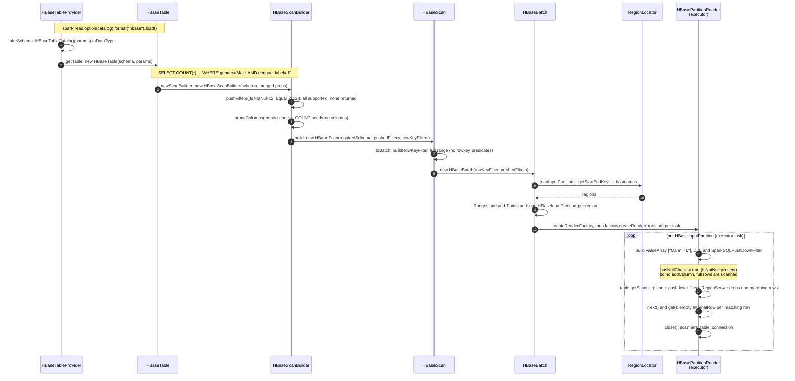

```mermaid
sequenceDiagram
    autonumber
    participant TP as HBaseTableProvider
    participant T as HBaseTable
    participant SB as HBaseScanBuilder
    participant SC as HBaseScan
    participant B as HBaseBatch
    participant META as RegionLocator
    participant PR as HBasePartitionReader<br/>(executor)

    Note over TP,T: spark.read.option(catalog).format("hbase").load()
    TP->>TP: inferSchema: HBaseTableCatalog(params).toDataType
    TP->>T: getTable: new HBaseTable(schema, params)

    Note over T,SB: SELECT COUNT(*) ... WHERE gender='Male' AND dengue_label='1'
    T->>SB: newScanBuilder: new HBaseScanBuilder(schema, merged props)
    SB->>SB: pushFilters([IsNotNull x2, EqualTo x2]): all supported, none returned
    SB->>SB: pruneColumns(empty schema, COUNT needs no columns)
    SB->>SC: build: new HBaseScan(requiredSchema, pushedFilters, rowKeyFilters)
    SC->>SC: toBatch: buildRowKeyFilter, full range (no rowkey predicates)
    SC->>B: new HBaseBatch(rowKeyFilter, pushedFilters)
    B->>META: planInputPartitions: getStartEndKeys + hostnames
    META-->>B: regions
    B->>B: Ranges.and and Points.and: one HBaseInputPartition per region
    B->>PR: createReaderFactory, then factory.createReader(partition) per task

    loop per HBaseInputPartition (executor task)
        PR->>PR: build valueArray ["Male", "1"], DLE and SparkSQLPushDownFilter
        Note over PR: hasNullCheck = true (IsNotNull present)<br/>so no addColumn, full rows are scanned
        PR->>PR: table.getScanner(scan + pushdown filter), RegionServer drops non-matching rows
        PR->>PR: next() and get(): empty InternalRow per matching row
        PR->>PR: close(): scanners, table, connection
    end
```