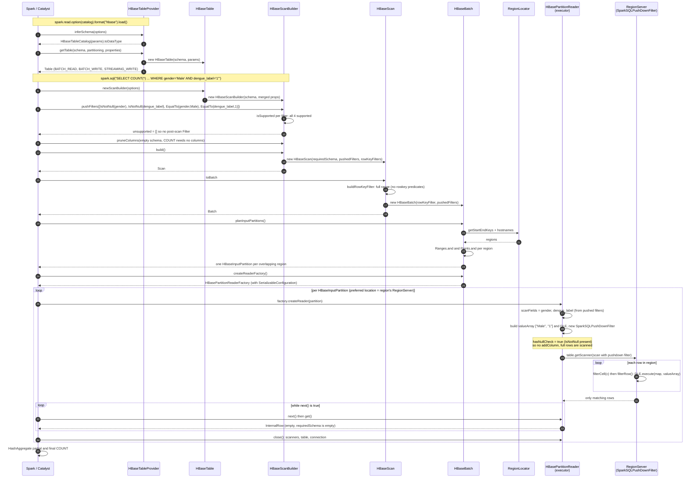

```mermaid
sequenceDiagram
    autonumber
    participant CAT as Spark / Catalyst
    participant TP as HBaseTableProvider
    participant T as HBaseTable
    participant SB as HBaseScanBuilder
    participant SC as HBaseScan
    participant B as HBaseBatch
    participant META as RegionLocator
    participant PR as HBasePartitionReader<br/>(executor)
    participant RS as RegionServer<br/>(SparkSQLPushDownFilter)

    Note over CAT,TP: spark.read.option(catalog).format("hbase").load()
    CAT->>TP: inferSchema(options)
    TP-->>CAT: HBaseTableCatalog(params).toDataType
    CAT->>TP: getTable(schema, partitioning, properties)
    TP->>T: new HBaseTable(schema, params)
    TP-->>CAT: Table (BATCH_READ, BATCH_WRITE, STREAMING_WRITE)

    Note over CAT,SB: spark.sql("SELECT COUNT(*) ... WHERE gender='Male' AND dengue_label='1'")
    CAT->>T: newScanBuilder(options)
    T->>SB: new HBaseScanBuilder(schema, merged props)
    CAT->>SB: pushFilters([IsNotNull(gender), IsNotNull(dengue_label), EqualTo(gender,Male), EqualTo(dengue_label,1)])
    SB->>SB: isSupported per filter: all 4 supported
    SB-->>CAT: unsupported = [] so no post-scan Filter
    CAT->>SB: pruneColumns(empty schema, COUNT needs no columns)
    CAT->>SB: build()
    SB->>SC: new HBaseScan(requiredSchema, pushedFilters, rowKeyFilters)
    SB-->>CAT: Scan
    CAT->>SC: toBatch
    SC->>SC: buildRowKeyFilter: full range (no rowkey predicates)
    SC->>B: new HBaseBatch(rowKeyFilter, pushedFilters)
    SC-->>CAT: Batch
    CAT->>B: planInputPartitions()
    B->>META: getStartEndKeys + hostnames
    META-->>B: regions
    B->>B: Ranges.and and Points.and per region
    B-->>CAT: one HBaseInputPartition per overlapping region
    CAT->>B: createReaderFactory()
    B-->>CAT: HBasePartitionReaderFactory (with SerializableConfiguration)

    loop per HBaseInputPartition (preferred location = region's RegionServer)
        CAT->>PR: factory.createReader(partition)
        PR->>PR: scanFields = gender, dengue_label (from pushed filters)
        PR->>PR: build valueArray ["Male", "1"] and DLE, new SparkSQLPushDownFilter
        Note over PR: hasNullCheck = true (IsNotNull present)<br/>so no addColumn, full rows are scanned
        PR->>RS: table.getScanner(scan with pushdown filter)
        loop each row in region
            RS->>RS: filterCell(c) then filterRow(): DLE.execute(map, valueArray)
        end
        RS-->>PR: only matching rows
        loop while next() is true
            CAT->>PR: next() then get()
            PR-->>CAT: InternalRow (empty, requiredSchema is empty)
        end
        CAT->>PR: close(): scanners, table, connection
    end
    CAT->>CAT: HashAggregate partial and final COUNT
```