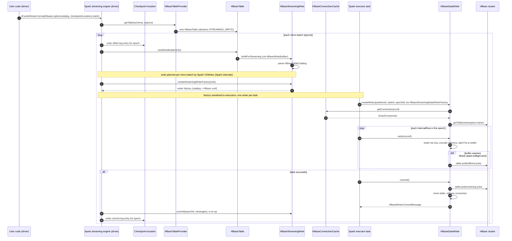

```mermaid
sequenceDiagram
  autonumber
  participant App as User code (driver)
  participant Engine as Spark streaming engine (driver)
  participant Ckpt as Checkpoint location
  participant Provider as HBaseTableProvider
  participant Table as HBaseTable
  participant SW as HBaseStreamingWrite
  participant Cache as HBaseConnectionCache
  participant Task as Spark executor task
  participant Writer as HBaseDataWriter
  participant HBase as HBase cluster

  App->>Engine: df.writeStream.format(hbase).option(catalog, checkpointLocation).start()
  Engine->>Provider: getTable(schema, options)
  Provider->>Table: new HBaseTable (declares STREAMING_WRITE)
  loop each micro-batch (epoch)
    Engine->>Ckpt: write offset log entry for epoch
    Engine->>Table: newWriteBuilder(info)
    Table->>SW: buildForStreaming (via HBaseWriteBuilder)
    SW->>SW: parse HBaseTableCatalog
    Note over Engine,SW: write planned per micro-batch by Spark V2Writes (Spark internals)
    Engine->>SW: createStreamingWriterFactory(info)
    SW-->>Engine: writer factory (catalog + HBase conf)
    Note over Engine,Task: factory serialized to executors, one writer per task
    Task->>Writer: createWriter(partitionId, taskId, epochId) via HBaseStreamingDataWriterFactory
    Writer->>Cache: getConnection(conf)
    Cache-->>Writer: SmartConnection
    Writer->>HBase: getTable(namespace:name)
    loop each InternalRow in the epoch
      Task->>Writer: write(record)
      Writer->>Writer: build row key, encode columns, add Put to buffer
      opt buffer reaches hbase.spark.bulkget.size
        Writer->>HBase: table.put(buffered puts)
      end
    end
    alt task succeeds
      Task->>Writer: commit()
      Writer->>HBase: table.put(remaining puts)
      Writer->>Writer: close table, release connection
      Writer-->>Task: HBaseWriterCommitMessage
      Engine->>SW: commit(epochId, messages), a no-op
      Engine->>Ckpt: write commit log entry for epoch
    end
  end
```