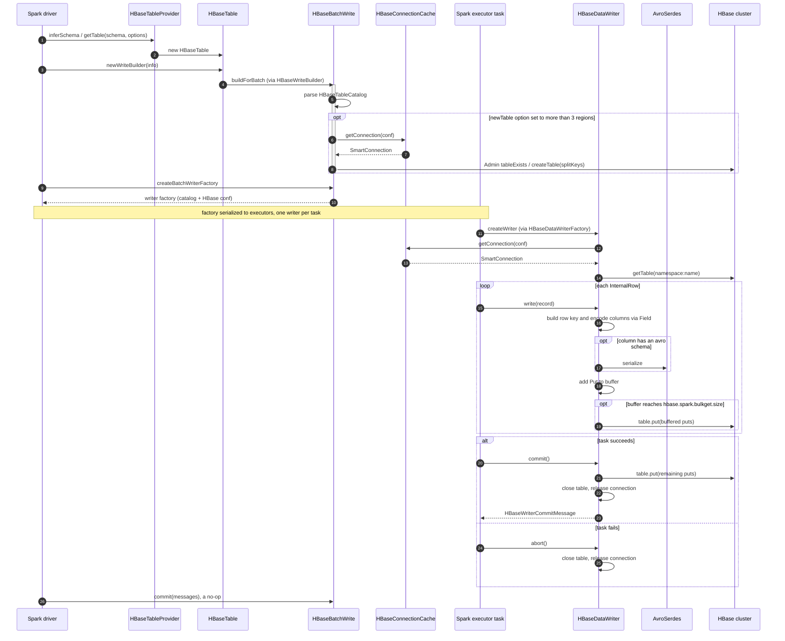

```mermaid
sequenceDiagram
  autonumber
  participant Spark as Spark driver
  participant Provider as HBaseTableProvider
  participant Table as HBaseTable
  participant BatchWrite as HBaseBatchWrite
  participant Cache as HBaseConnectionCache
  participant Task as Spark executor task
  participant Writer as HBaseDataWriter
  participant Avro as AvroSerdes
  participant HBase as HBase cluster

  Spark->>Provider: inferSchema / getTable(schema, options)
  Provider->>Table: new HBaseTable
  Spark->>Table: newWriteBuilder(info)
  Table->>BatchWrite: buildForBatch (via HBaseWriteBuilder)
  activate BatchWrite
  BatchWrite->>BatchWrite: parse HBaseTableCatalog
  opt newTable option set to more than 3 regions
    BatchWrite->>Cache: getConnection(conf)
    Cache-->>BatchWrite: SmartConnection
    BatchWrite->>HBase: Admin tableExists / createTable(splitKeys)
  end
  deactivate BatchWrite
  Spark->>BatchWrite: createBatchWriterFactory
  BatchWrite-->>Spark: writer factory (catalog + HBase conf)
  Note over Spark,Task: factory serialized to executors, one writer per task
  Task->>Writer: createWriter (via HBaseDataWriterFactory)
  Writer->>Cache: getConnection(conf)
  Cache-->>Writer: SmartConnection
  Writer->>HBase: getTable(namespace:name)
  loop each InternalRow
    Task->>Writer: write(record)
    Writer->>Writer: build row key and encode columns via Field
    opt column has an avro schema
      Writer->>Avro: serialize
    end
    Writer->>Writer: add Put to buffer
    opt buffer reaches hbase.spark.bulkget.size
      Writer->>HBase: table.put(buffered puts)
    end
  end
  alt task succeeds
    Task->>Writer: commit()
    Writer->>HBase: table.put(remaining puts)
    Writer->>Writer: close table, release connection
    Writer-->>Task: HBaseWriterCommitMessage
  else task fails
    Task->>Writer: abort()
    Writer->>Writer: close table, release connection
  end
  Spark->>BatchWrite: commit(messages), a no-op
```